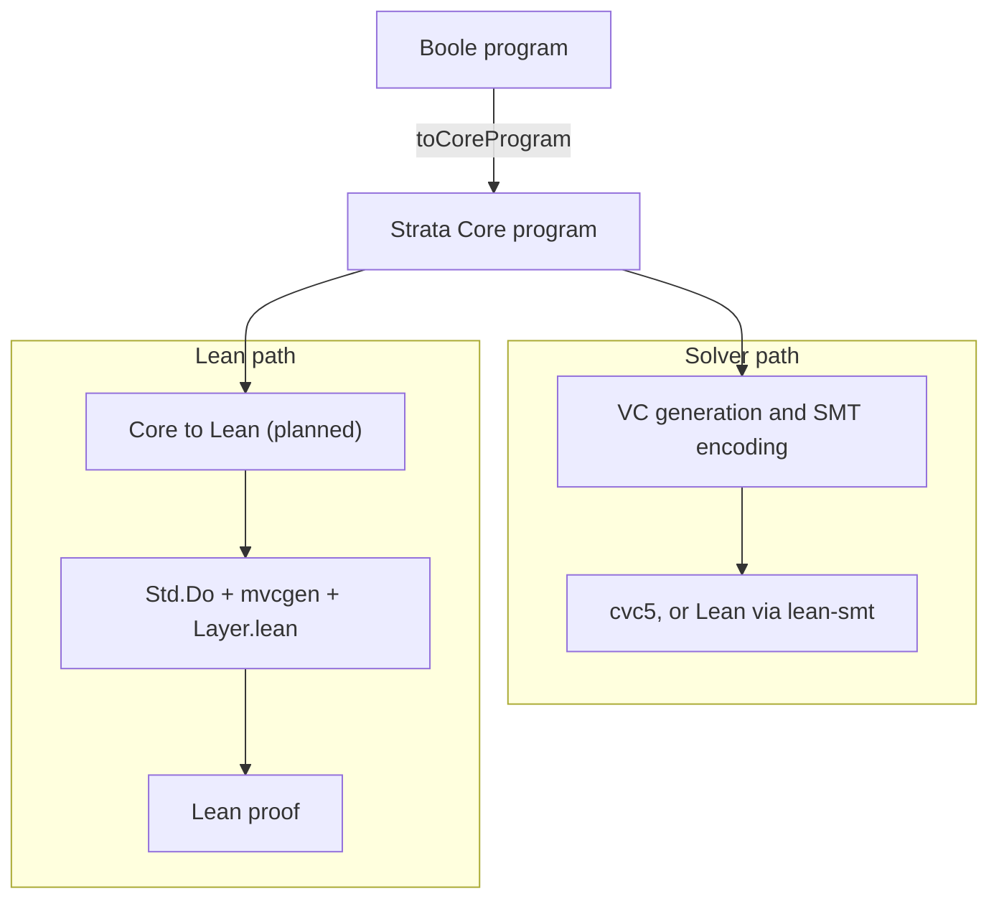

# Shallow embedding of Strata in Lean

The goal is to interpret Strata Core programs in Lean as computations in a
nondeterministic state monad. Verification conditions come from proved
weakest-precondition rules, so the generator is sound by construction. The design follows
Velvet; the code builds on Lean's `Std.Do` and `mvcgen`. Boole programs reach it through
their lowering to Core.

## Decisions

- **Input is Core**, which has a formal semantics (`StatementSemantics.lean`), so the
  interpretation can be proved adequate against it. Boole and other front ends lower to
  Core.
- **Framework: `Std.Do` and `mvcgen`**, available in Lean 4.29 and 4.31. Lean marks
  `mvcgen` experimental; its successor `vcgen` needs Lean 4.33.
- **No Velvet dependency:** Velvet needs Lean 4.34.

## Mapping

| Core | Lean |
| --- | --- |
| assignments, `if`, locals | `do` notation |
| `exit` from a loop or the procedure | `break`, `return` |
| other labeled `exit` | to do, e.g. one exception per label |
| `while` without a measure, `havoc`, `assume`, `assert` | `Layer.lean` |
| `while` with a measure, nondeterministic `init`, `if *`, `while *` | to do |
| `call` | the callee's proved specification |
| `in`, `inout`, `out` parameters (Boole's globals and `modifies` become these) | arguments and results |
| `int`, `bool`, `nat`, `bv n`, `Sequence`, `Map` | `Int`, `Bool`, `Nat`, `BitVec n`, `List`/`Array`, functions |
| datatypes | inductive types |
| `cover`, local function and type declarations | to do |

## Status

`StrataBoole/Shallow/Layer.lean` provides a nondeterminism monad with `havoc`, `assume`,
`assert` and a `while` loop carrying its invariant, each with a proved rule.
`StrataBooleTest/shallow_find_max.lean` verifies three hand-written programs with it,
find max among them, and fixes the form the translation should produce. The proofs use
only Lean's standard axioms.

## Research questions

1. **Variables:** represent program variables so that verification conditions range over
   Lean values. In the hand-written programs they already are; the open part is getting
   there from Core, in particular with an interpreter.
2. **Invariants:** pass the invariants recorded in the program to the monadic loop rules.
   `whileInv` takes the invariant as an argument and its rule uses it; loops with a
   measure are still missing.
3. **Adequacy:** prove the interpretation adequate with respect to Core's operational
   semantics. One detail: in Core a failed `assert` sets a failure flag and execution
   continues, while in `Layer.lean` it ends the run.
4. **`cover` and frames** have no counterpart in Velvet. Frames follow from Core's
   `in`/`inout` parameters. `cover` checks that some path reaches it with its condition
   true, which is not a weakest-precondition fact.

## Open questions

- **Translator or interpreter:** generate Lean code for each program, or define the
  interpretation as one Lean function, which makes adequacy a single theorem.
- **Execution:** `ND` is a set of outcomes, so it cannot run programs; Velvet's monad can.
- **`assume`:** in Boogie an impossible `assume` makes the path vacuous; Velvet's choice
  operator instead requires proving that a value exists. `Layer.lean` follows Boogie.
- **Reads:** a checked read needs an `assert` or Lean's `a[i]'h`. Core leaves an
  out-of-range `select!` unconstrained, while Lean's `a[i]!` returns a default value,
  which proofs must not rely on.
- **Goal names:** `mvcgen` numbers the goals; they should carry the program's clause names.
- **Axioms:** a program's axioms become either Lean axioms, which are trusted, or
  hypotheses of each theorem.

## Sources

- [Velvet (CAV'26)](https://ilyasergey.net/assets/pdf/papers/velvet-cav26.pdf)
- [Foundational Multi-Modal Program Verifiers (Loom, POPL'26)](https://ilyasergey.net/assets/pdf/papers/loom-popl26.pdf)
- [verse-lab/velvet](https://github.com/verse-lab/velvet)
- [ilyasergey/lean-vcgen-tutorial](https://github.com/ilyasergey/lean-vcgen-tutorial)
